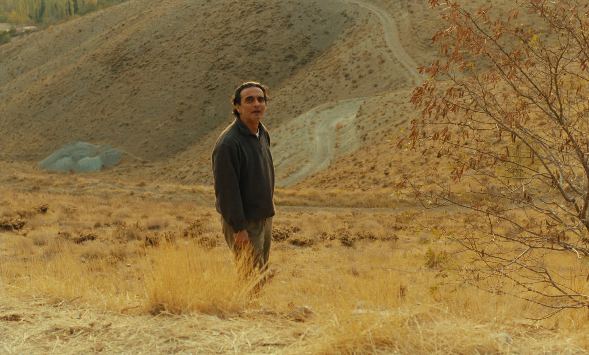
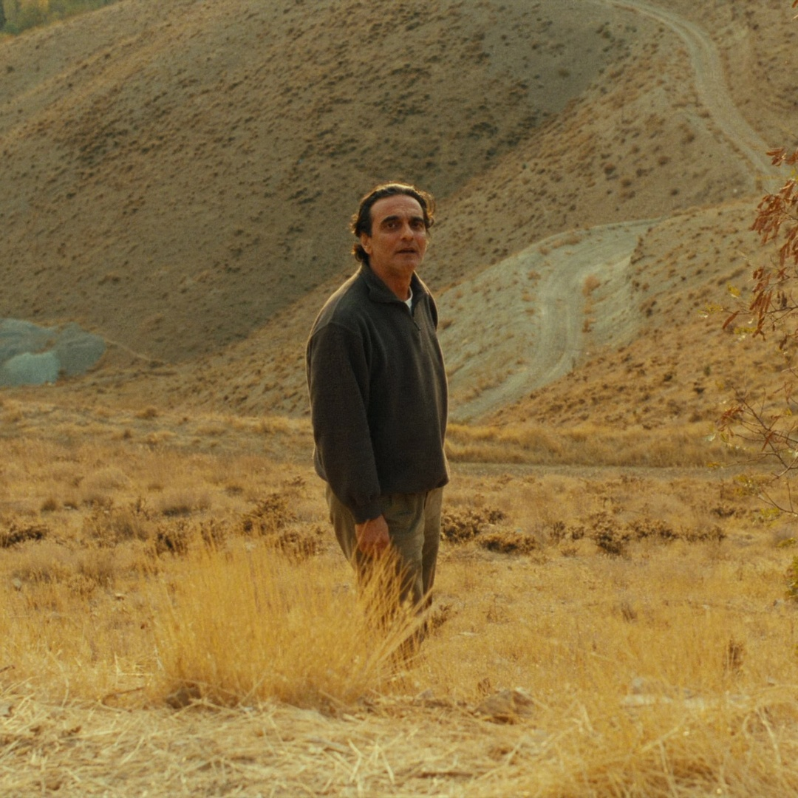
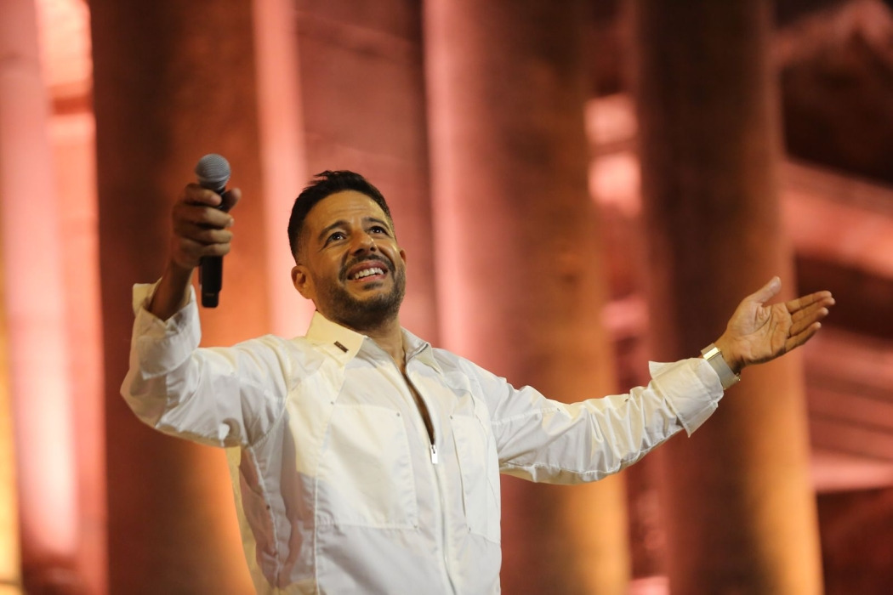
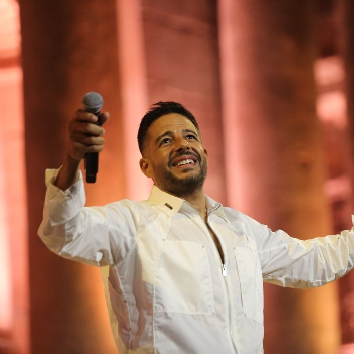
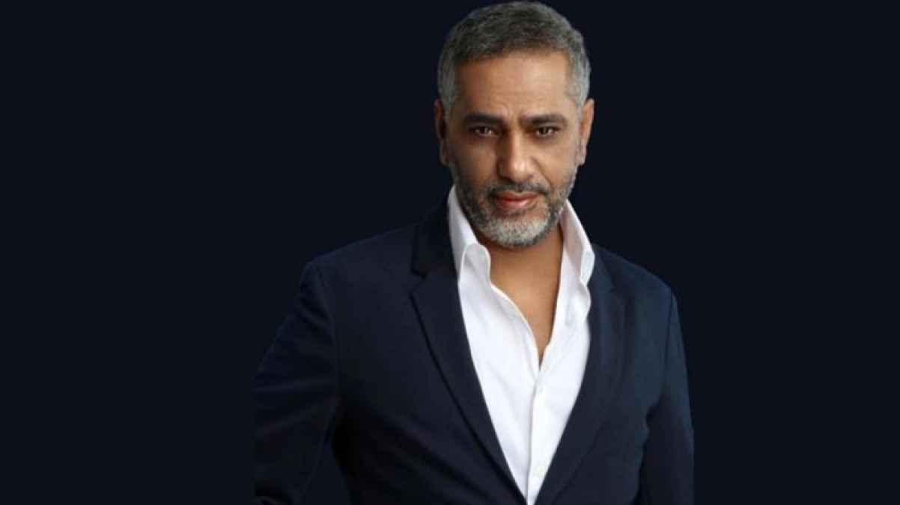
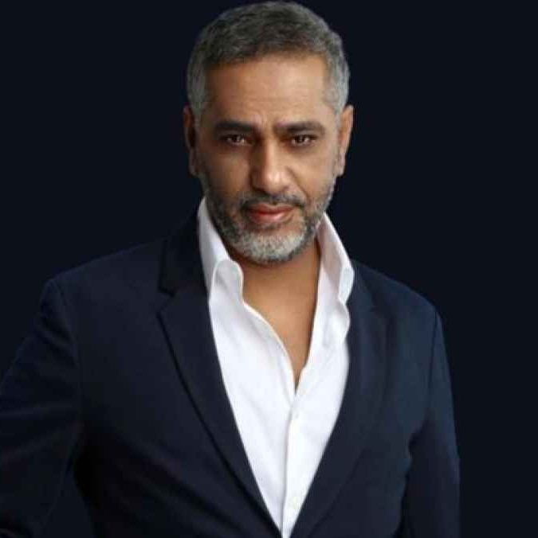
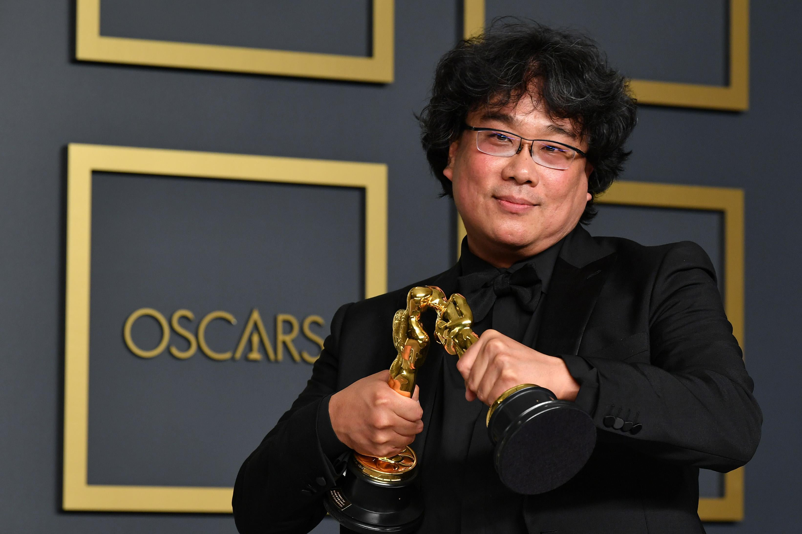
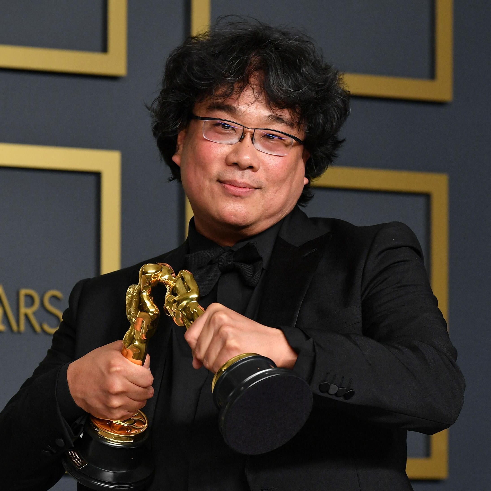

# Face Cropper

Stripped down functionality from [Face Crop Plus](https://github.com/mantasu/face-crop-plus) using [AMD's RetinaFace ONNX](https://huggingface.co/amd/retinaface) with no PyTorch dependancy, a 1.7 MB model artifact and a single file of code for inference.

# Why

What I need: square image of one face from image of one face that is not square.

What I don't need: 7GB venv with CUDA PyTorch dependencies.

# How

Detects bbox of a face (one face) in the picture (using RetinaFace and ONNX for inference) then crops a square around it with the face being in the center (cv2 slicing).

# Setup
```bash
uv venv
uv pip install -r requirements.txt
. .venv/bin/activate
```

# Usage
```bash
python crop.py image.jpg # saves output to crop.jpg
```

# Examples












# Contributing

No. This isn't for you, it's to save my time, if it helps, I'm glad, if it doesn't, fork and adapt it.